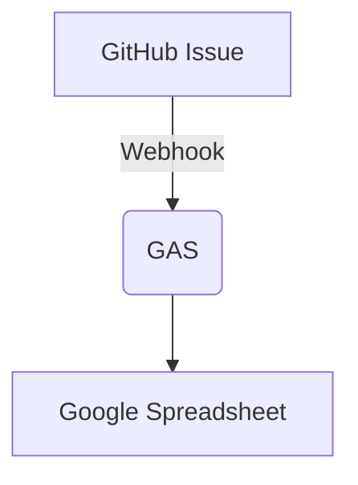
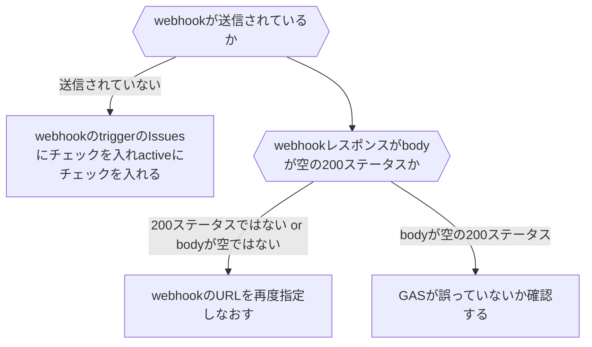

# GitHub IssueをSpreadsheetに自動で転写したい

## 動機

皆さんGitHub Issueは好きですよね．
私は大好きです．開いてるIssueを連続でどんどん閉じていく快感は筆舌に尽くし難いです．

しかしながら，不具合報告を行ってくれる営業の方やプロジェクトにお金を割り振る経営陣の方がGitHubに堪能であるとは限りません．
リポジトリを横断したプロジェクトの進行度を把握したり，放置されている問題がないか横断的に見る場合はGoogle Spreadsheetに軍配が上がる場合もあるでしょう．

今回はGitHub Issueに行われた変更をすべて自動でSpreadsheetに転写する仕組みを構築したので紹介します．

## 仕様

Google Spreadsheetの指定のシートにIssueの情報を転記します．
まだシートに記入されていなければ追記，すでにシート上にあれば更新します．

[Issues - GitHub Docs](https://docs.github.com/en/rest/reference/issues#list-issues-assigned-to-the-authenticated-user--code-samples) で得られる情報がすべて利用できます．

## システム構成

GitHubのWebhook機能を用いてGoogle Spreadseetに関連付いたGASのdoPostを叩き，その内容で更新します．
GitHubもGASもGoogle Spreadsheetもすべて無料でサーバーを立てる必要がない点が利点です．

## 導入手順

### 1. GASウェブアプリの準備
Google Spreadsheetを作成し，`ツール -> スクリプト エディタ` からGASの編集画面に入ります．
以下の関数をすべて実装します

@[gist](https://gist.github.com/forno/25d89389061d7ba0f309c0eeb693aaf0?file=core.gs)
@[gist](https://gist.github.com/forno/25d89389061d7ba0f309c0eeb693aaf0?file=webhook.gs)

次にスクリプト エディタ右上のデプロイボタンから新しいデプロイを押下し，ウェブアプリをデプロイします．
このとき，次のユーザとして実行に「自分」，アクセスできるユーザに「全員」を指定してください．

### 2. GitHubのWebhookにURLを登録

デプロイするとURLが発行されます．`https://script.google.com/macros/s/xxxxxx/exec`という形式のものです．
このURLをコピーし，GitHubのWebhooksに登録します．

RepositoryかOrganizationのsettingを開き，Webhooksの設定ページを開きます．
Add webhookを押下して出てきたダイアログのPayload URLに「先ほどのURL」，Content typeを「`application/json`」，Which events would you like to trigger this webhook?を「Issues」のみチェックを入れ，Add webhookします．

### 3. 動作確認

適当なIssueを立ててGoogle Spreadsheetにデータが増えるか確認します．

データが増えない場合はまずGitHub Webhooksを確認します．

GASを確認することになった場合は次の関数を追加して下さい．
@[gist](https://gist.github.com/forno/25d89389061d7ba0f309c0eeb693aaf0?file=test.gs)

そして，追加した`testDoGithubWebhookJson`をデバッグ実行します．
生じるエラーを確認し，core.gsやwebhook.gsの実装に問題がないか確認してください．

まったく問題が無い場合は，GitHubのWebhooksの設定に問題があると思われるので，URLの指定や，triggerの指定，activeであるかを確認してください．

## カスタマイズ

`core.gs`の`convertIssue2array`をカスタマイズすることで好きな情報をGoogle Spreadsheetに転記できます．
また，`core.gs`の`SHEET_NAME`を変えることで転記するシート名を変更できます．

# 総括

たった60行前後のコードでGitHubのIssueをGoogle Spreadsheetに転記することができました．
これで営業の方や経営陣の方にさぼっていると思われずに済みますね．

自分のところでは営業が作ったシートに書かれた問題とIssueを結びつけるカラムを追加することで転記した情報を最大限活用しています．
営業や経営陣が欲しい情報が自動で得られるようにしておけば業務を最大限効率化できます．
もし，営業が問題共有にGoogle Spreadsheetを使用してくる場合には是非今回のシステムを導入してコミュニケーションコストを削減してください．

## 追記
今回説明した内容では既存のIssueをspreadsheetに転記する方法については解説していません．
しかし以下のスクリプトを適切に利用することで，手動で全Issueのデータを追加する事ができます．

詳しい解説は後日書くかもしれませんし，書かないかもしれません．

@[gist](https://gist.github.com/forno/25d89389061d7ba0f309c0eeb693aaf0?file=manual.gs)
